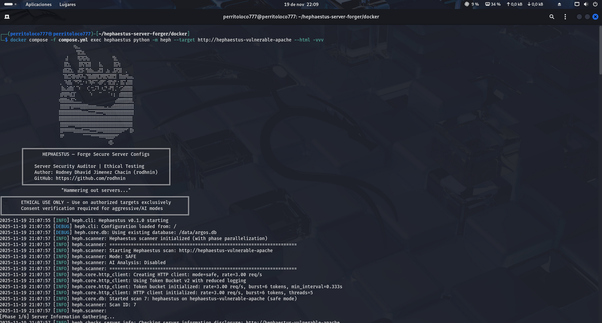
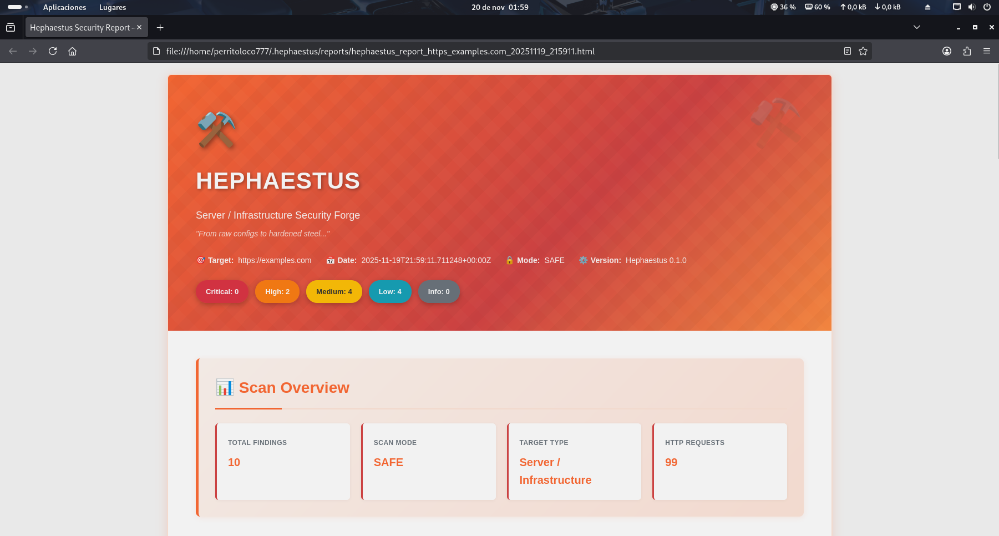
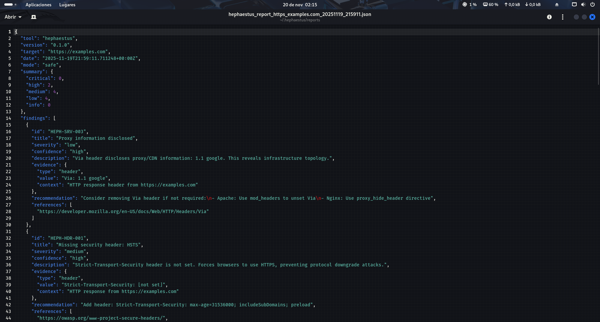

# Hephaestus — Server Security Auditor ⚒️

```
                              ⠀⠀⠀⠀⠀⠰⣦⣀⠀⠀⠀⠀⠀⠀⠀⠀⠀⠀⠀⠀⠀⠀⠀⠀⠀⠀⠀⠀
                              ⠀⠀⠀⠀⠀⠀⠘⣿⣳⣆⠀⠀⠀⠀⠀⠀⠀⠀⠀⠀⠀⠀⠀⠀⠀⠀⠀⠀
                              ⠀⠀⢠⡇⠀⠀⠀⢿⡽⣯⢷⡄⠀⠀⠀⠀⠀⠀⠀⠀⢻⣆⠀⠀⠀⠀⠀⠀
                              ⠀⠀⣿⣳⡀⠀⠀⢸⡿⡝⣯⣿⠀⠀⠀⣧⡀⠀⠀⠀⢸⣯⢷⠀⠀⠀⠀⠀
                              ⠀⢰⣿⣽⣳⡀⠀⣼⣻⠅⢻⣾⣦⣀⣠⣟⡇⢀⣦⠀⣸⡽⣻⡇⠀⡀⠀⠀
                              ⠀⠈⣿⣞⡫⣿⢶⡿⡽⢤⠙⣿⣾⣿⢿⣹⢿⣟⢯⣿⣟⡇⢸⣷⣶⢿⣤⣄
                              ⢀⠀⠹⣾⣧⠈⠛⠝⣃⠂⠆⠹⡾⠍⠡⣾⠟⡁⢺⣟⣾⢃⠂⣿⡍⣼⣿⡇
                              ⠀⣷⣄⣵⣿⡎⠈⠱⠀⠀⠰⡁⢒⡨⠹⠀⢆⡙⠠⠟⡇⡈⠐⣩⣾⣿⣿⡇
                              ⢰⡿⣿⠿⣾⣹⠁⠀⠀⠀⠀⠈⠆⠀⠀⠉⠀⠀⠈⠰⢰⠀⢰⣿⣿⣿⣿⡇
                              ⢾⣿⣿⣶⣼⣍⣂⣀⡀⠀⠀⠀⠀⠀⠀⠀⠀⠀⠀⠀⠀⣴⣿⣿⣿⣿⣿⣇
                              ⢸⣿⣿⣿⢻⡿⠿⠿⣿⣿⣿⣶⣶⣶⣤⣤⣤⣀⣄⣠⣾⣿⣿⣿⣿⣿⣿⣿
                              ⣿⣿⣿⣿⣿⣿⣿⣿⣷⣶⣶⣭⣭⣽⣛⣛⡻⢿⣿⣿⣿⣿⣿⣿⣿⣿⣿⣿
                              ⣿⣿⣿⣿⣿⣿⣿⣿⣿⣿⣿⣿⣿⣿⣿⣿⣿⣿⣿⣿⣿⣿⣿⣿⣿⣿⣿⡇
                              ⢸⣿⣿⡿⠿⠿⣿⣿⣿⣿⣿⣿⣿⣿⣿⣿⣿⣿⣿⣿⣿⣿⣿⣿⣿⣿⣿⡇
                              ⢸⡿⠿⠿⠿⢿⣶⣶⣾⣭⣭⣝⣛⣛⡿⠿⢿⣿⣿⣿⣿⣿⣿⡿⠟⠋⢸⡷
                              ⠸⠟⠀⠀⠀⠀⠀⠀⠀⠉⠉⠉⠛⠛⠛⠿⠿⢿⣿⣿⡿⠛⠁⠀⠀⠀⠀⠀
                              ⠀⠀⠀⠀⠀⠀⠀⠀⠀⠀⠀⠀⠀⠀⠀⠀⠀⠀⠰⣿⠄⠀⠀⠀⠀⠀⠀⠀
                ╔══════════════════════════════════════════════════════╗
                ║       HEPHAESTUS — Forge Secure Server Configs       ║
                ║                                                      ║
                ║    Server Security Auditor | Ethical Testing         ║
                ║    Author: Rodney Dhavid Jimenez Chacin (rodhnin)    ║
                ║    Web: https://www.rodhnin.com                      ║
                ╚══════════════════════════════════════════════════════╝
                              "Hammering out servers..."
        ╔═════════════════════════════════════════════════════════════════════╗
        ║       ETHICAL USE ONLY - Use on authorized targets exclusively      ║
        ║       Consent verification required for aggressive/AI modes         ║
        ╚═════════════════════════════════════════════════════════════════════╝
```

<div align="center">

[](https://opensource.org/licenses/MIT)
[](https://www.python.org/downloads/)
[](https://github.com/rodhnin/hephaestus-server-forger/releases)
[]()
[](https://hub.docker.com/)
[](https://openai.com)

**Comprehensive server security auditor with AI-powered hardening guides.**  
_Safe-by-default • Consent-verified • Evidence-focused_

[Features](#-features) • [Quick Start](#-quick-start) • [Documentation](#-documentation) • [AI Integration](#-ai-powered-analysis) • [Roadmap](#-roadmap)

</div>

---

## 🎯 What is Hephaestus?

Hephaestus is a **production-ready server security auditor** that puts **ethics first**. Built for system administrators, DevOps engineers, and penetration testers, it scans web server configurations (Apache, Nginx, IIS) to identify critical misconfigurations before attackers exploit them.

### Why Hephaestus?

-   **🔒 Ethical by Design**: Consent token system prevents unauthorized scanning
-   **🤖 AI-Powered**: GPT-4, Claude, or local Ollama for intelligent hardening guides
-   **📊 Professional Reports**: Beautiful HTML + machine-readable JSON
-   **🚀 Fast & Efficient**: Concurrent scanning with intelligent rate limiting
-   **💾 Persistent Tracking**: SQLite database **SHARED with Argos suite** (`~/.argos/argos.db`)
-   **🐳 Docker Ready**: Containerized scanning + vulnerable test labs (Apache & Nginx)
-   **🎯 Zero False Positives**: Extensively tested with 55+ validation tests

### What It Scans

| Check Category            | Details                                                                                 |
| ------------------------- | --------------------------------------------------------------------------------------- |
| **Server Information**    | Apache/Nginx/IIS version disclosure via headers & error pages                           |
| **Sensitive Files**       | .env, .git, phpinfo.php, server-status, backups, config files                           |
| **HTTP Methods**          | Unsafe methods (PUT, DELETE, TRACE, OPTIONS)                                            |
| **Security Headers**      | HSTS, CSP, X-Frame-Options, X-Content-Type-Options, Referrer-Policy, Permissions-Policy |
| **TLS/SSL Configuration** | Protocol versions, cipher suites, certificate validity                                  |
| **Directory Listing**     | Apache/Nginx autoindex enabled on sensitive directories                                 |

---

## 🎬 Demo

### Scanner in Action

<div align="center">
  

_Demo showing:_

-   CLI execution with real-time progress indicators
-   Vulnerability detection and evidence collection
-   HTML report generation
</div>

---

## 📸 Screenshots

### Console Execution

<div align="center">
  

_Real-time scan execution_

</div>

### HTML Report

<div align="center">
  

_Beautiful, HTML report with:_

-   🎨 Forge theme with orange/red gradients
-   🏷️ Color-coded severity badges (Critical, High, Medium, Low, Info)
-   📝 Expandable evidence sections showing HTTP responses
-   🤖 AI-generated hardening guides (technical + executive modes)
-   📊 Server information and TLS/SSL analysis sections
</div>

### JSON Report

<div align="center">
  

_Machine-readable JSON report for:_

-   🤖 Programmatic processing and automation
-   📈 Historical analysis and reporting
-   🔍 Detailed findings with evidence and severity classification
</div>

---

## ✨ Features

### 🛡️ Core Security Auditing

```bash
# One command, comprehensive server analysis
python -m heph --target https://example.com --html
```

-   **Multi-Server Support**: Apache, Nginx, IIS detection and hardening
-   **Concurrent Scanning**: Thread pool + rate limiting for fast, respectful scans
-   **Evidence Collection**: HTTP responses, headers, file contents preserved
-   **Graceful Error Handling**: Timeouts, DNS failures, connection refused handled robustly

### 🤖 AI-Powered Hardening Guides

Choose your AI provider based on your needs:

| Provider             | Best For           | Speed           | Cost          | Privacy         |
| -------------------- | ------------------ | --------------- | ------------- | --------------- |
| **OpenAI GPT-4**     | Production quality | ⚡ Fast (35s)   | 💰 $0.25/scan | 🔒 Standard     |
| **Anthropic Claude** | Privacy-focused    | ⚡ Fast (45s)   | 💰 $0.30/scan | 🔒 Enhanced     |
| **Ollama (Local)**   | Complete privacy   | 🐢 Slow (28min) | 💰 Free       | 🔐 100% Offline |

**Two Analysis Modes:**

-   **Technical**: Apache/Nginx config snippets, CLI commands, step-by-step hardening
-   **Executive**: Plain-language risk assessment for stakeholders and management

### 📊 Professional Reporting

**JSON Reports** (Machine-Readable)

```json
{
  "tool": "hephaestus",
  "version": "0.1.0",
  "target": "https://example.com",
  "mode": "safe",
  "summary": {
    "critical": 3,
    "high": 2,
    "medium": 5,
    "low": 3,
    "info": 0
  },
  "findings": [...]
}
```

**HTML Reports** (Human-Friendly)

-   🎨 Forge theme with orange/red gradients (⚒️ blacksmith aesthetic)
-   🏷️ Color-coded severity badges
-   📝 Expandable evidence sections
-   🤖 AI hardening guides beautifully formatted
-   📱 Mobile-responsive design

### 🔐 Consent Token System

Aggressive scanning and AI analysis require **proof of ownership**:

```bash
# 1. Generate token
python -m heph --gen-consent example.com

# 2. Place token on your server
echo "verify-abc123..." > .well-known/verify-abc123.txt

# 3. Verify ownership
python -m heph --verify-consent http --domain example.com --token verify-abc123

# 4. Now you can use aggressive mode
python -m heph --target https://example.com --aggressive --use-ai
```

### 💾 Database Persistence

SQLite database **SHARED with Argos suite** (`~/.argos/argos.db`):

-   **Scan History**: Date, duration, findings count, severity breakdown
-   **Finding Repository**: Searchable vulnerability database (1159+ findings stored)
-   **Verified Domains**: Consent token tracking with expiration
-   **Cross-Tool Integration**: Works seamlessly with Argus, Pythia, and future tools

```bash
# Query recent scans
sqlite3 ~/.argos/argos.db "SELECT * FROM scans WHERE tool='hephaestus' ORDER BY scan_id DESC LIMIT 10"

# Find critical issues
sqlite3 ~/.argos/argos.db "SELECT * FROM findings WHERE severity='critical' AND tool='hephaestus'"
```

---

## ✅ Validation & Testing

Hephaestus v0.1.0 has been **empirically validated** using controlled Docker-based vulnerable labs (Apache & Nginx).

### Validation Summary (November 2025)

| Metric                    | Result                                            |
| ------------------------- | ------------------------------------------------- |
| **Test Suite**            | 55/55 tests passing (10 phases)                   |
| **Apache Detection**      | 21 findings (6 critical, 2 high, 8 medium, 5 low) |
| **Nginx Detection**       | 13 findings (3 critical, 2 high, 5 medium, 3 low) |
| **Precision**             | 100% (zero false positives)                       |
| **Recall**                | 100% (zero false negatives)                       |
| **F1-Score**              | 100% (perfect balance)                            |
| **Average Scan Duration** | 21-22 seconds                                     |
| **Database Operations**   | 80 scans tracked, 1159+ findings stored           |

**Test Coverage:**

-   ✅ **Phase 1**: Basic CLI (exit codes, error handling)
-   ✅ **Phase 2**: Consent tokens (HTTP verification, aggressive mode)
-   ✅ **Phase 3**: AI integration (OpenAI, Anthropic, Ollama)
-   ✅ **Phase 4**: Report generation (JSON, HTML, AI analysis)
-   ✅ **Phase 5**: Advanced options (rate limiting, threads, timeouts)
-   ✅ **Phase 6**: Check modules (6 modules, 34 findings validated)
-   ✅ **Phase 7**: Logging (text, JSON, verbosity levels)
-   ✅ **Phase 8**: Database (schema, integrity, foreign keys)
-   ✅ **Phase 9**: Error handling (edge cases, permissions)
-   ✅ **Phase 10**: Integration (Argos suite compatibility)

**Key Findings:**

-   ✅ All critical vulnerabilities detected (.env, .git, server-status, phpinfo)
-   ✅ All server versions identified (Apache 2.4.54, Nginx 1.18.0)
-   ✅ All security headers analyzed correctly (6 headers checked)
-   ✅ All directory listing issues identified
-   ✅ Resilient error handling (timeouts, DNS failures, connection refused)

**Verdict:** Hephaestus is **production-ready** for server security assessments.

---

## 🚀 Quick Start

### Prerequisites

-   **Python 3.11+** (3.12 recommended)
-   **pip** (Python package manager)
-   **Docker** (optional, for vulnerable labs)

### Installation

**1. Clone the repository**

```bash
git clone https://github.com/rodhnin/hephaestus-server-forger.git
cd hephaestus-server-forger
```

**2. (Optional) Install `venv` if not already available**

```bash
# Debian/Ubuntu
sudo apt update && sudo apt install -y python3-venv

# Fedora/RHEL
sudo dnf install python3-virtualenv

# macOS (via Homebrew)
brew install python@3.11
```

**3. Create and activate virtual environment**

```bash
python3 -m venv .venv
source .venv/bin/activate
# You should see (.venv) in your terminal prompt
```

**4. Upgrade pip**

```bash
python -m pip install --upgrade pip
```

**5. Install dependencies**

```bash
python -m pip install -r requirements.txt
```

**6. Configure API keys (if using cloud AI)**

```bash
# OpenAI
export OPENAI_API_KEY="sk-..."

# Anthropic
export ANTHROPIC_API_KEY="sk-ant-..."
```

**7. Verify installation**

```bash
python -m heph --version
# Output: heph 0.1.0
```

### Your First Scan

```bash
# Basic scan (safe mode, no consent required)
python -m heph --target https://example.com

# With HTML report
python -m heph --target https://example.com --html

# With AI hardening guide (requires consent)
python -m heph --target https://example.com --use-ai --html
```

### 🐳 Quick Start with Docker

cd docker && ./deploy.sh

# Select option 3 for testing (Both)

docker compose exec hephaestus python -m heph --target http://vulnerable-apache

**🎉 Success!** Check `~/.hephaestus/reports/` for your reports.

---

## 📘 Usage Guide

### Basic Scanning

```bash
# Safe mode (default) - Non-intrusive checks
python -m heph --target https://example.com

# Generate HTML report
python -m heph --target https://example.com --html

# Increase verbosity for debugging
python -m heph --target https://example.com -vv

# Quiet mode (errors only)
python -m heph --target https://example.com -q
```

### Advanced Scanning

```bash
# Control scan speed (1-20 req/s)
python -m heph --target https://example.com --rate 10

# Control concurrency (1-20 threads)
python -m heph --target https://example.com --threads 8

# Custom timeout (useful for slow servers)
python -m heph --target https://example.com --timeout 60

# Custom output directory
python -m heph --target https://example.com --report-dir ./my-reports

# Custom User-Agent
python -m heph --target https://example.com --user-agent "MyBot/1.0"

# Disable SSL verification (testing only)
python -m heph --target https://self-signed.badssl.com --no-verify-ssl
```

### AI-Powered Hardening Guides

**Step 1: Configure your provider**

Edit `config/defaults.yaml`:

```yaml
ai:
    langchain:
        provider: "openai" # Options: openai, anthropic, ollama
        model: "gpt-4-turbo-preview"
        temperature: 0.3
```

**Step 2: Test your setup**

```bash
# Verify AI provider works
python -m heph.core.ai openai
```

**Step 3: Run AI-powered scan**

```bash
# Technical hardening guide (for sysadmins)
python -m heph --target https://example.com \
  --use-ai \
  --ai-tone technical \
  --html

# Executive risk summary (for management)
python -m heph --target https://example.com \
  --use-ai \
  --ai-tone non_technical \
  --html

# Both analyses in one report
python -m heph --target https://example.com \
  --use-ai \
  --ai-tone both \
  --html
```

### Aggressive Mode (Requires Consent)

```bash
# Step 1: Generate consent token
python -m heph --gen-consent example.com
# Output: Token: verify-a3f9b2c1d8e4...

# Step 2: Place token on your server
# Create: https://example.com/.well-known/verify-a3f9b2c1d8e4.txt
# Content: verify-a3f9b2c1d8e4

# Step 3: Verify consent
python -m heph --verify-consent http \
  --domain example.com \
  --token verify-a3f9b2c1d8e4

# Step 4: Run aggressive scan (deeper checks, higher rate limit)
python -m heph --target https://example.com --aggressive
```

---

## 🤖 AI-Powered Analysis

Hephaestus uses **LangChain 1.0.0** with support for multiple AI providers.

### Supported Providers

#### OpenAI GPT-4 Turbo

**Best for: Production use**

-   ⭐ Quality: Excellent (5/5)
-   ⚡ Speed: ~35 seconds
-   💰 Cost: ~$0.25 per scan
-   🔒 Privacy: Standard (data encrypted in transit)

```bash
export OPENAI_API_KEY="sk-..."
python -m pip install langchain-openai==1.0.0
```

#### Anthropic Claude

**Best for: Enhanced privacy**

-   ⭐ Quality: Excellent (5/5)
-   ⚡ Speed: ~45 seconds
-   💰 Cost: ~$0.30 per scan
-   🔒 Privacy: Enhanced (Anthropic's privacy-first approach)

```bash
export ANTHROPIC_API_KEY="sk-ant-..."
python -m pip install langchain-anthropic==1.0.0
```

#### Ollama (Local Models)

**Best for: Complete privacy**

-   ⭐ Quality: Good (3/5)
-   🐢 Speed: ~28 minutes (CPU) or ~75 seconds (GPU)
-   💰 Cost: Free
-   🔐 Privacy: 100% offline (data never leaves your machine)

```bash
# Install Ollama: https://ollama.ai
ollama pull llama3.2
python -m pip install "langchain-ollama>=0.3.0,<0.4.0"
```

### Privacy & Security

**Automatic Sanitization**

Before sending to AI providers, Hephaestus automatically removes:

-   ✅ Consent tokens
-   ✅ API keys and credentials
-   ✅ Private keys and certificates
-   ✅ Internal IP addresses
-   ✅ Database credentials

**Opt-In Only**

-   AI analysis requires explicit `--use-ai` flag
-   Aggressive scanning requires verified consent token
-   You control which provider sees your data

**For Maximum Privacy**: Use Ollama locally.

---

## 🧪 Safe Testing Labs

**⚠️ NEVER scan production sites without written permission!**

Use our Docker labs to practice safely:

### Setup Test Environment

### Option 1: Interactive Script (Recommended)

```bash
# Run the interactive deployment script
cd docker && ./deploy.sh
```

The script provides 5 options:

1. **Production** → Deploy Hephaestus scanner service
2. **Testing Lab** → Deploy vulnerable web servers (Apache + Nginx)
3. **Both** → Deploy both environments
4. **Stop All** → Stop all running services
5. **Remove All** → Remove containers, volumes, and data (requires confirmation)

### Option 2: Manual Docker Compose

**Testing Lab Only:**

```bash
# Start vulnerable servers (Apache + Nginx)
docker compose -f docker/compose.testing.yml up -d

# Wait for initialization (~15 seconds)
sleep 15

# Verify services
docker compose -f docker/compose.testing.yml ps
curl -I http://localhost:8080  # Apache
curl -I http://localhost:8081  # Nginx
```

**Production Scanner:**

```bash
# Start Hephaestus scanner service
docker compose -f docker/compose.yml up -d

# Run a scan
docker compose -f docker/compose.yml exec hephaestus heph --target https://example.com

# View reports
ls -lh docker/reports/
```

**Both Environments:**

```bash
# Start both production and testing
docker compose -f docker/compose.yml up -d
docker compose -f docker/compose.testing.yml up -d

# Scan the testing labs from host
python -m heph --target http://localhost:8080 --html
python -m heph --target http://localhost:8081 --html
```

### Scan the Labs

```bash
# Scan Apache lab (from host)
python -m heph --target http://localhost:8080 --html

# Scan Nginx lab (from host)
python -m heph --target http://localhost:8081 --html

# AI-powered analysis (requires OPENAI_API_KEY)
python -m heph --target http://localhost:8080 --use-ai --html

# OR from inside production container (using container name)
docker compose -f docker/compose.yml exec hephaestus python -m heph --target http://hephaestus-vulnerable-apache --html
```

### Expected Results

**Apache Lab (localhost:8080):**

-   21 findings total
-   6 critical (.env, 2x.git, 2xphpinfo, server-status)
-   2 high (version disclosure, TLS missing)
-   8 medium (headers, TRACE, directory listing)
-   5 low (headers, .htaccess/htpasswd)

**Nginx Lab (localhost:8081):**

-   13 findings total
-   3 critical (.env, 2x.git)
-   2 high (version disclosure, TLS missing)
-   5 medium (headers, directory listing)
-   3 low (headers)

### Cleanup

**Stop services:**

```bash
# Using script
cd docker && ./deploy.sh  # Choose option 4 (Stop All)

# OR manually
docker compose -f docker/compose.yml down
docker compose -f docker/compose.testing.yml down
```

**Remove everything (WARNING: deletes data and reports):**

```bash
# Using script (with confirmation)
cd docker && ./deploy.sh  # Choose option 5 (Remove All)

# OR manually
docker compose -f docker/compose.yml down -v
docker compose -f docker/compose.testing.yml down -v
rm -rf docker/data docker/reports
```

---

## 🐳 Docker Deployment

Hephaestus provides two Docker deployment options:

### Option 1: Docker Compose (Recommended)

**Production Scanner Service:**

```bash
# Start long-running scanner service
docker compose -f docker/compose.yml up -d

# Run scans
docker compose -f docker/compose.yml exec hephaestus heph --target https://example.com --html

# View reports
ls -lh docker/reports/

# Stop service
docker compose -f docker/compose.yml down
```

**Testing Lab (Vulnerable Servers):**

```bash
# Start Apache + Nginx vulnerable servers
docker compose -f docker/compose.testing.yml up -d

# Scan from host
python -m heph --target http://localhost:8080 --html

# Stop lab
docker compose -f docker/compose.testing.yml down
```

**Interactive Deployment Script:**

```bash
# Use the interactive menu
cd docker && ./deploy.sh
```

### Option 2: Direct Docker Run

**Build the image:**

```bash
docker build -f docker/Dockerfile -t hephaestus:0.1.0 .
```

**Run a one-off scan:**

```bash
docker run --rm \
  -v $(pwd)/docker/reports:/reports \
  -v $(pwd)/docker/data:/data \
  hephaestus:0.1.0 \
  --target https://example.com \
  --html
```

**With AI analysis:**

```bash
docker run --rm \
  -v $(pwd)/docker/reports:/reports \
  -e OPENAI_API_KEY="$OPENAI_API_KEY" \
  hephaestus:0.1.0 \
  --target https://example.com \
  --use-ai \
  --ai-tone both \
  --html
```

**Scan local testing lab:**

```bash
# Start testing lab first
docker compose -f docker/compose.testing.yml up -d

# Scan from container (join the testing lab network)
docker run --rm \
  --network hephaestus-lab \
  hephaestus:0.1.0 \
  --target http://hephaestus-vulnerable-apache
```

---

## 📊 Understanding Reports

### Report Structure

```
~/.hephaestus/
├── reports/
│   ├── hephaestus_report_example_20251021_143022.json
│   └── hephaestus_report_example_20251021_143022.html
└── (shared with Argos)
    ~/.argos/
    ├── argos.db          # Shared database
    └── logs/
        └── hephaestus.log
```

### Finding IDs (Pattern)

```
HEPH-SRV-001: Server version disclosed (Apache/Nginx/IIS)
HEPH-SRV-004: Server disclosed in error page
HEPH-FILE-001: Environment file exposed (.env)
HEPH-FILE-002: Git repository exposed
HEPH-FILE-003: PHP information page exposed
HEPH-FILE-004: Apache server-status exposed
HEPH-HTTP-003: Unsafe HTTP method in OPTIONS (TRACE)
HEPH-HTTP-008: TRACE method enabled (XST vulnerability)
HEPH-HDR-001: Missing security header: HSTS
HEPH-HDR-002: Missing security header: CSP
HEPH-HDR-003: Missing security header: X-Frame-Options
HEPH-HDR-004: Missing security header: X-Content-Type-Options
HEPH-HDR-005: Missing security header: Referrer-Policy
HEPH-HDR-006: Missing security header: Permissions-Policy
HEPH-CFG-001: Directory listing enabled
HEPH-TLS-000: TLS not enabled
HEPH-TLS-001: Weak TLS protocol (SSLv3, TLS 1.0)
```

### Severity Mapping

-   **CRITICAL**: .env exposed, .git accessible, phpinfo, server-status, SQL dumps
-   **HIGH**: Server version disclosed, weak TLS, TLS missing, unsafe HTTP methods
-   **MEDIUM**: Missing important headers (HSTS, CSP, X-Frame-Options), directory listing, error page disclosure
-   **LOW**: Minor headers (X-Content-Type-Options, Referrer-Policy, Permissions-Policy)
-   **INFO**: Informational findings (server detected, TLS 1.2 OK)

---

## 📁 Project Structure

```
hephaestus-server-forger/
│
├── heph/                       # Main application package
│   ├── checks/                 # Security check modules
│   │   ├── __init__.py
│   │   ├── config.py           # Directory listing checks
│   │   ├── files.py            # Sensitive file detection
│   │   ├── headers.py          # Security headers analysis
│   │   ├── http_methods.py     # HTTP methods testing
│   │   ├── server_info.py      # Server fingerprinting
│   │   └── tls.py              # TLS/SSL configuration
│   │
│   ├── core/                   # Core infrastructure
│   │   ├── __init__.py
│   │   ├── ai.py               # AI integration (LangChain)
│   │   ├── config.py           # Configuration management
│   │   ├── consent.py          # Consent token system
│   │   ├── db.py               # SQLite database (shared with Argos)
│   │   ├── http_client.py      # Rate-limited HTTP client
│   │   ├── logging.py          # Structured logging
│   │   └── report.py           # Report generation
│   │
│   ├── __init__.py             # Package metadata
│   ├── __main__.py             # Entry point
│   ├── cli.py                  # CLI argument parser
│   └── scanner.py              # Main scan orchestrator
│
├── config/                     # Configuration files
│   ├── defaults.yaml           # Default settings
│   └── prompts/                # AI prompt templates
│       ├── technical.txt       # Technical hardening prompt
│       └── non_technical.txt   # Executive summary prompt
│
├── db/
│   └── migrate.sql             # Shared database schema (Argos)
│
├── docker/                     # Docker deployment
│   ├── vulnerable-apache/                 # Vulnerable Apache lab script
│   │   └── docker-entrypoint.sh
│   ├── vulnerable-nginx/                  # Vulnerable Nginx lab script
│   │   └── docker-entrypoint.sh
│   ├── compose.yml
│   └── Dockerfile              # Production image
│
├── docs/                       # Documentation
│   ├── AI_INTEGRATION.md       # AI setup guide
│   ├── CONSENT.md              # Consent system details
│   ├── DATABASE_GUIDE.md       # Database reference
│   ├── ETHICS.md               # Ethical guidelines
│   ├── REPORT_FORMAT.md        # Report specification
│   ├── ROADMAP.md              # Development roadmap
│   ├── TESTING_GUIDE.md        # Safe testing practices
│   └── VALIDATION_REPORT.md    # Tests that validate the tool
│
├── schema/
│   └── report.schema.json      # JSON report schema
│
├── scripts/
│   └── cli-examples.md         # CLI usage examples
│
├── templates/
│   └── report.html.j2          # HTML report template (Jinja2)
│
├── CHANGELOG.md                # Version history
├── LICENSE                     # MIT License
├── README.md                   # This file
├── requirements.txt            # Python dependencies
└── setup.py                    # Package installer
```

---

## 🗺️ Roadmap

### v0.1.0 — Initial Release ✅ (November 2025)

**Status:** 🎉 **Released**

-   ✅ 6 security check modules (server, files, methods, headers, TLS, config)
-   ✅ AI-powered hardening guides (OpenAI, Anthropic, Ollama)
-   ✅ Consent token system (HTTP + DNS verification)
-   ✅ Professional reporting (JSON + HTML with AI analysis)
-   ✅ SQLite persistence (SHARED with Argos suite: `~/.argos/argos.db`)
-   ✅ Docker support with vulnerable labs (Apache & Nginx)
-   ✅ Comprehensive error handling and resilience
-   ✅ 55+ validation tests (10 phases, 100% passing)

### v0.2.0 — Enhanced Detection (Q2 2026)

**Focus:** Detection accuracy, AI features, reporting improvements

-   🔜 **Deep TLS Analysis**: SSLyze integration for cipher suites, protocols, certificate chains
-   🔜 **Framework Detection**: Laravel, Symfony, Express.js, Django, Rails
-   🔜 **Apache/Nginx Config Parser**: Analyze httpd.conf, nginx.conf for misconfigurations
-   🔜 **PHP.ini Audit**: Detect dangerous PHP settings (allow_url_fopen, display_errors)
-   🔜 **Enhanced HTML Reports**: CVE badges, configuration snippets, better UX
-   🔜 **AI Cost Tracking**: Budget limits, token usage monitoring
-   🔜 **AI Streaming**: Real-time progress for long analyses
-   🔜 **PDF Export**: Customizable PDF reports with branding

### v0.3.0 — Enterprise Features (Q3 2026)

**Focus:** Usability, scale, interactive AI

-   🔜 **Interactive Config Management**: Metasploit-style interface (`heph --show-options`, `heph --set`)
-   🔜 **Database CLI**: No SQL required (`heph db scans list`, `heph db findings search`)
-   🔜 **Multi-Site Scanning**: Batch processing from file
-   🔜 **AI Chat Interface**: Conversational hardening guidance
-   🔜 **CI/CD Integration**: GitHub Actions, Jenkins, GitLab templates
-   🔜 **REST API Server**: FastAPI-based API for automation
-   🔜 **Nmap Integration**: Port scanning for comprehensive assessment

### v0.4.0 — Intelligence & Automation (Q4 2026)

**Focus:** ML, automation, advanced AI

-   🔜 **Automated Remediation**: Ansible/Puppet playbooks for auto-fixing
-   🔜 **ML-Based Detection**: Anomaly detection, false positive reduction
-   🔜 **Distributed Scanning**: Worker nodes for large-scale operations
-   🔜 **Advanced AI Agents**: Autonomous scan planning, exploit generation

### Pro Track (Q1 2027)

**Commercial product for enterprises**

**IN PROCESS**

For detailed feature descriptions, see [ROADMAP.md](docs/ROADMAP.md)

---

## 🔒 Ethics & Legal

### The Golden Rule

**Only scan systems you own or have explicit written permission to test.**

### Consent Enforcement

Hephaestus implements **technical controls** to prevent misuse:

| Mode            | Checks          | Consent Required | Rate Limit |
| --------------- | --------------- | ---------------- | ---------- |
| **Safe**        | Non-intrusive   | ❌ No            | 3 req/s    |
| **Aggressive**  | Deep probing    | ✅ Yes           | 8 req/s    |
| **AI Analysis** | Hardening guide | ✅ Yes           | N/A        |

### Legal Framework

Unauthorized access to computer systems is **illegal** in most jurisdictions:

-   🇺🇸 **USA**: Computer Fraud and Abuse Act (CFAA)
-   🇬🇧 **UK**: Computer Misuse Act 1990
-   🇪🇺 **EU**: Directive 2013/40/EU
-   🌍 **International**: Various cybercrime laws

### Best Practices

1. ✅ **Get written authorization** before scanning
2. ✅ **Define scope clearly** (which domains/IPs)
3. ✅ **Document everything** (consent, findings, remediation)
4. ✅ **Use safe mode first** to establish baseline
5. ✅ **Report findings responsibly** (coordinated disclosure)
6. ❌ **Never exploit vulnerabilities** without explicit permission
7. ❌ **Never scan third-party sites** (e.g., apache.org, nginx.com)

For complete ethical guidelines, see [docs/ETHICS.md](docs/ETHICS.md)

---

## 🤝 Contributing

We welcome contributions! Whether it's:

-   🐛 Bug reports
-   💡 Feature requests
-   📝 Documentation improvements
-   🔧 Code contributions

### How to Contribute

1. **Fork the repository**
2. **Create a feature branch** (`git checkout -b feature/amazing-feature`)
3. **Make your changes**
4. **Write/update tests** (when applicable)
5. **Commit your changes** (`git commit -m 'Add amazing feature'`)
6. **Push to the branch** (`git push origin feature/amazing-feature`)
7. **Open a Pull Request**

### Development Setup

```bash
# Clone your fork
git clone https://github.com/YOUR-USERNAME/hephaestus-server-forger.git
cd hephaestus-server-forger

# Install development dependencies
python -m pip install -r requirements.txt
python -m pip install pytest black flake8 mypy

# Run code formatting
black heph/

# Run linting
flake8 heph/
mypy heph/

# Run tests (when available)
pytest tests/
```

### Reporting Issues

Found a bug? Have a feature request?

**Open an issue**: https://github.com/rodhnin/hephaestus-server-forger/issues

Please include:

-   Hephaestus version (`python -m heph --version`)
-   Python version (`python --version`)
-   Operating system
-   Steps to reproduce (for bugs)
-   Expected vs actual behavior

---

## 📚 Documentation

Comprehensive documentation available in the `docs/` directory:

| Document                                    | Description                               |
| ------------------------------------------- | ----------------------------------------- |
| [AI_INTEGRATION.md](docs/AI_INTEGRATION.md) | Complete AI setup guide (all 3 providers) |
| [CONSENT.md](docs/CONSENT.md)               | Consent token system technical details    |
| [DATABASE_GUIDE.md](docs/DATABASE_GUIDE.md) | SQLite schema, queries, management        |
| [ETHICS.md](docs/ETHICS.md)                 | Legal framework and ethical guidelines    |
| [REPORT_FORMAT.md](docs/REPORT_FORMAT.md)   | JSON schema and HTML specifications       |
| [TESTING_GUIDE.md](docs/TESTING_GUIDE.md)   | Safe testing with Docker labs             |
| [ROADMAP.md](docs/ROADMAP.md)               | Future features and development plans     |

### Quick Links

-   **Changelog**: [CHANGELOG.md](CHANGELOG.md)
-   **License**: [LICENSE](LICENSE)
-   **CLI Examples**: [scripts/cli-examples.md](scripts/cli-examples.md)

---

## ⚖️ License

This project is licensed under the **MIT License** - see the [LICENSE](LICENSE) file for details.

```
MIT License

Copyright (c) 2026 Rodney Dhavid Jimenez Chacin

Permission is hereby granted, free of charge, to any person obtaining a copy
of this software and associated documentation files (the "Software"), to deal
in the Software without restriction, including without limitation the rights
to use, copy, modify, merge, publish, distribute, sublicense, and/or sell
copies of the Software, and to permit persons to whom the Software is
furnished to do so, subject to the following conditions:

The above copyright notice and this permission notice shall be included in all
copies or substantial portions of the Software.

THE SOFTWARE IS PROVIDED "AS IS", WITHOUT WARRANTY OF ANY KIND, EXPRESS OR
IMPLIED, INCLUDING BUT NOT LIMITED TO THE WARRANTIES OF MERCHANTABILITY,
FITNESS FOR A PARTICULAR PURPOSE AND NONINFRINGEMENT.
```

---

## ⚠️ Disclaimer

**IMPORTANT:** This tool is for **authorized security testing only**.

### Legal Notice

By using Hephaestus, you acknowledge and agree that:

1. ✅ You will **only scan systems you own** or have **explicit written permission** to test
2. ✅ You will **comply with all applicable laws** and regulations
3. ✅ You understand that **unauthorized access is illegal** (CFAA, Computer Misuse Act, etc.)
4. ✅ The author and contributors **assume no liability** for misuse
5. ✅ This software is provided **"as-is" without warranty** of any kind

### Responsible Disclosure

If you discover vulnerabilities using Hephaestus:

-   📧 Contact the site owner privately first
-   ⏰ Give reasonable time to fix (typically 90 days)
-   🤝 Coordinate disclosure timeline
-   📝 Document your findings professionally

### When in Doubt

**Don't scan.** If you're unsure whether you have permission, you probably don't.

---

## 🙏 Acknowledgments

Hephaestus stands on the shoulders of giants:

-   **Apache & Nginx** — Documentation and hardening guides
-   **OWASP** — Security standards (Top 10, Testing Guide, Secure Headers Project)
-   **CIS Benchmarks** — Server hardening best practices
-   **LangChain** — AI framework for intelligent analysis
-   **Anthropic & OpenAI** — AI models for vulnerability analysis
-   **Ollama** — Local AI inference for privacy-focused scanning
-   **Python Community** — Amazing libraries and tools

Special thanks to all security researchers who practice and promote ethical hacking.

---

## 👤 Author

**Rodney Dhavid Jimenez Chacin (rodhnin)**

-   🌐 Website & Contact: [rodhnin.com](https://rodhnin.com)
-   💼 GitHub: [@rodhnin](https://github.com/rodhnin)
-   🔗 Project: [hephaestus-server-forger](https://github.com/rodhnin/hephaestus-server-forger)

For questions, feedback, or collaboration inquiries, please visit [rodhnin.com](https://rodhnin.com) to contact me.

---

## 💬 Community

-   **Discussions**: [GitHub Discussions](https://github.com/rodhnin/hephaestus-server-forger/discussions)
-   **Issues**: [GitHub Issues](https://github.com/rodhnin/hephaestus-server-forger/issues)
-   **Releases**: [GitHub Releases](https://github.com/rodhnin/hephaestus-server-forger/releases)

---

<div align="center">

**Built with ❤️ for ethical hackers and sysadmins worldwide**

⭐ **Star this repo** if you find it useful! ⭐

[Report Bug](https://github.com/rodhnin/hephaestus-server-forger/issues) • [Request Feature](https://github.com/rodhnin/hephaestus-server-forger/issues) • [Documentation](docs/)

---

_Hephaestus v0.1.0 — November 2025_

</div>
